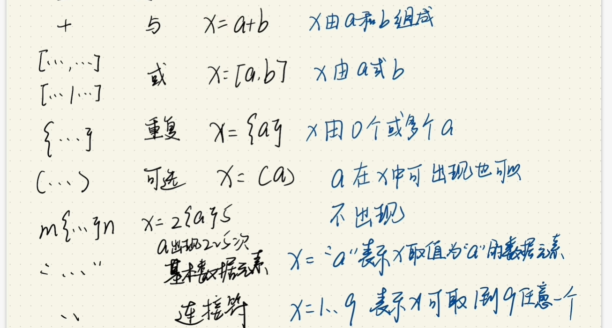
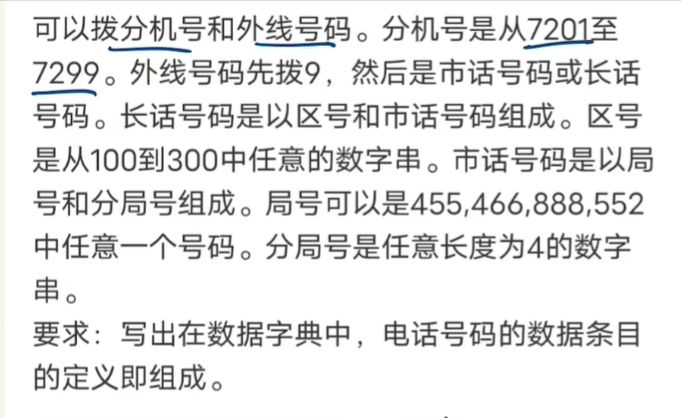
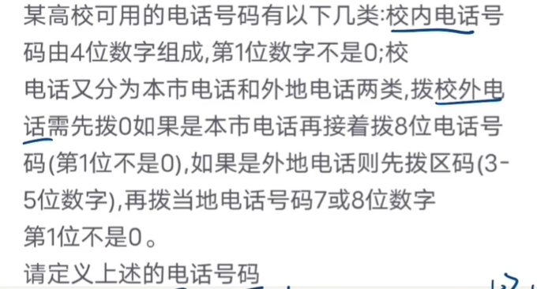
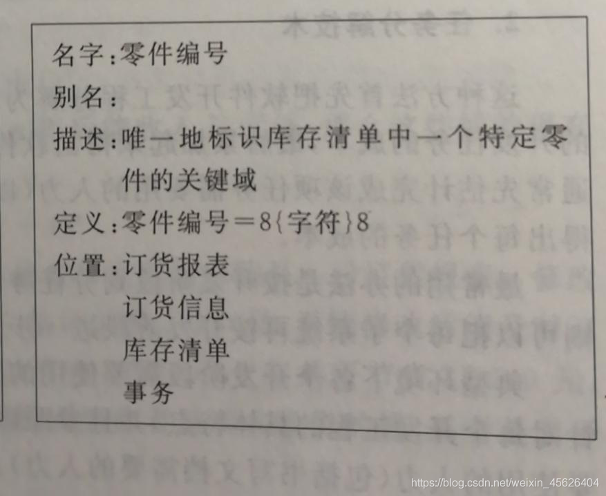
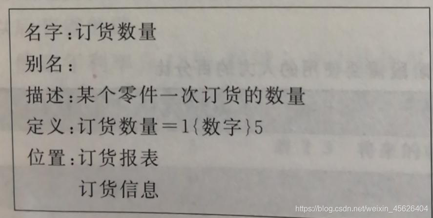

## 软件工程~数据字典例子解释

[第1006号小白](https://blog.csdn.net/weixin_45626404 "第1006号小白")  于 2021-01-08 01:39:54 发布

### 软件工程~[数据字典](https://so.csdn.net/so/search?q=%E6%95%B0%E6%8D%AE%E5%AD%97%E5%85%B8&spm=1001.2101.3001.7020)（个人理解）

> **数据字典**：关于数据的信息的集合，也就是对[数据流图](https://so.csdn.net/so/search?q=%E6%95%B0%E6%8D%AE%E6%B5%81%E5%9B%BE&spm=1001.2101.3001.7020)中包含的所有元素的定义的集合。

-   如果开发小型软件系统时暂时没有数据字典的处理程序，建议使用卡片形式书写数据字典，这里先看一个实例

  
这种数据字典卡片主要包含：**名字、别名、描述、定位、位置。**

|      |                                                     |
| ---- | --------------------------------------------------- |
| 别名 | 对于同样的数据，不同用户或者分析员使用不同名字      |
| 描述 | 详细的含义                                          |
| 定位 | 是由什么组成的                                      |
| 位置 | 他最终存在在哪里，一张表还是输出到打印机 还是其他的 |

  
这里面的**8{字符}8**是什么意思呢？

-   数据元素组成数据的方式只有3种基本类型  
    （1）顺序：以确定次序连接两个或多个分量  
    （2）选择：从两个或多个可能的元素中选取一个  
    （3）重复：把确定的分量重复零次或多次  
    可以使用上述3种关系算符定义数据字典中的任何条目，虽然可以使用自然语言描述由数据元素组成数据的关系，但是为了更加清晰简洁，建议采用以下符号。

|       | 意思                              |
| ----- | --------------------------------- |
| \=    | 等价于或定义为                    |
| +     | 和                                |
| \[ \] | 选择，通常包含多个分量，分量间用" |
| { }   | 重复                              |
| ( )   | 可选                              |

（1）=：被定义为。  
（2）+：与。例如，X=a+b表示x由a和 b组成。  
（3）\[…│…\]：或。例如，X=\[a│b\]表示x由a或b组成。  
（4）{…}：重复。例如，X={a}表示x由0个或多个a组成。  
（5）m{…}n或{…}nm：重复。例如：X=2{a}5或X={a}52表示x中最少出现2次a，最多出现5次a。5，2为重复次数的上、下限。  
（6）（…）：可选。例如，x=（a）表示a可在x中出现，也可不出现。  
（7）“…”：基本数据元素。例如，x=“a”，表示x是取值为字符a的数据元素。  
（8）“··”：连接符。例如，x=1··9，表示x可取1到9中任意一个值。  
符号使用案例：  
机票 = 姓名 + 日期 + 航班号 + 始发地 + 目的地 + 费用;  
航班号 = “CZ9938” ·· “CZ9948”;  
目的地 = \[上海 | 北京 | 广州\];

> 
>
> 接下来我们来做两道题目，从中我们可以熟悉他们的使用方法

-   eg1：某宾馆的电话服务如下：可以拨分机号和外线号。分机号从7201到7209；拨外线需要先按9，然后是市话号码或长话号码；长话号码是由区号和市话号码组成的；区号是44、55中任意一个号码；市话号码是由局号和分局号组成的；局号可以是455、466、888、552中任意一个号码；分局号是长度为4的数字串。请写出在数据字典中，电话号码的数据条目的定义及组成。
    
    电话号码 = \[分机号|外线号\]
    
    分机号 = \[7201 | 7202 | 7203 | 7204 | 7205 | 7206 | 7207 | 7208 | 7209\]
    
    外线号 = 9+\[市话号码|长话号码|\]
    
    长话号码 = 区号 + 市话号码
    
    区号 = \[44 | 55 \]
    
    市话号码 = 局号 + 分局号
    
    局号 = \[455|466|888|552\]
    
    分局号 =4{数字}4
    
    数字 =\[0 | 1 | 2 | 3 | 4 | 5 | 6 | 7 | 8 | 9 \]
    
-   eg2：北京某高校可用的电话号码有以下几种分类：校内电话由4位数字组成，第一位数字不是0；校外的电话又分为本市电话和外地电话两类，拨校外电话需先拨0，若是本市电话则借着拨8位数字（第一位不是0），若是外地电话则再拨3位区码再拨8位电话（第一位不是0）
    
    用定义数据的办法定义上述电话号码：
    
    电话号码 = \[校内电话 | 校外电话\]
    
    校内电话 = 非零数字 + 3位数字
    
    校外电话 = \[本市号码 | 外地号码\]
    
    本市号码 = 数字0 + 8位数字
    
    外地号码 = 数字0 + 3位数字 + 8位数字
    
    非零数字 = \[1 | 2 | 3 | 4 | 5 | 6 | 7 | 8 | 9\]
    
    数字0 = 0
    
    3位数字 = 3 {数字}3
    
    8位数字 = 非零数字 +=7位数字
    
    7位数字 = 7{数字}7
    
    数字 = \[0 | 1 | 2 | 3 | 4 | 5 | 6 | 7 | 8 | 9 \]
    

> **3{数字}3** 与 **1{数字}3**之间的差别在于，第一个的意思是固定长度为3的数字串，第二个是长度为1到3这个范围内的数字串

> 登记注册  
> 名字： 登记注册  
> 别名： 入住登记  
> 描述： 管理员登记入住客户信息  
> 定义： 登记注册=客户姓名+性别+年龄+房号+订餐密码+证件类型+证件号码+详细地址+电话+入住时间+入住天数+离店时间  
> 位置： 开房登记表

> 浏览选购  
> 名字： 浏览选购  
> 别名： 客户点餐  
> 描述： 客户选购菜品并将其加入餐车  
> 定义： 浏览选购=菜名+价格+数量  
> 位置： 点餐订单表

