## 软件工程 -- 数据流图的画法

[TOC]

## 1\. [数据流图](https://so.csdn.net/so/search?q=%E6%95%B0%E6%8D%AE%E6%B5%81%E5%9B%BE&spm=1001.2101.3001.7020)的画法

___

### 1.1 数据流图的概念

数据流图(Data Flow Diagram，DFD)是一种图形化技术，它描绘信息流和数据从输入移动到输出的过程中所经受的变换。

**数据流图的优点**：

1.  在数据流图中没有任何具体的物理元素，它只是描绘信息在软件中流动和被处理的情况。
2.  因为数据流图是系统逻辑功能的图形表示，即使不是专业的计算机技术人员也容易理解它，所以是分析员与用户之间极好的沟通工具。
3.  设计数据流图时只需考虑系统必须完成的基本逻辑功能，完全不需考虑怎样具体地实现这些功能，因此，它也是今后进行软件设计很好的出发点。
4.  数据流图可以在任何抽象层次上被用来表示系统或软件。事实上，数据流图可以被分层次地画，层次越低（在数据流图中1层比0层的层次更等）表现出的信息流细节和功能细节也越多。数据流图既提供了功能建模机制、也提供了信息流建模机制。

___

### 1.2 数据流图的基本符号

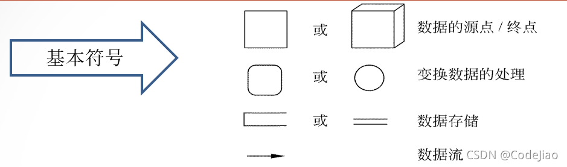  
数据流图有4种基本符号：

-   正方形（或立方体）表示数据的源点或终点；
-   圆角矩形（或圆形）代表变换数据的处理；
-   开口矩形（或两条平行横线）代表数据存储；
-   箭头表示数据流，即特定数据的流动方向。

初学者在画数据流图时，往往试图在数据流图中表现分支条件或循环，殊不知这样做将造成混乱，画不出正确的数据流图。在数据流图中应该描绘所有可能的数据流向，而不应该描绘出现某个数据流的条件。

> 注意：

-   处理并不一定是一个程序。一个处理框可以代表一系列程序、单个程序或者程序的一个模块；它甚至可以代表用穿孔机穿孔或目视检查数据正确性等人工处理过程。
-   一个数据存储也并不等同于一个文件，它可以表示一个文件、文件的一部分、数据库的元素、记录的一部分等；数据可以存储在磁盘、磁带、磁鼓、主存、微缩胶片、穿孔卡片及其他任何介质上（包括人的记忆）。
-   数据存储和数据流都是数据，仅仅所处的状态不同。数据存储是处于静止状态的数据，数据流是处于运动中的数据。
-   通常在数据流图中忽略出错处理，也不包括诸如打开或关闭文件之类的内务处理，数据流图的基本要点是描绘“做什么”而不考虑“怎样做”。
-   有时数据的源点和终点相同，这时如果只用一个符号代表数据的源点和终点，则将有两个箭头和这个符号相连（一个进一个出），可能其中一条箭头线相当长，这将降低数据流图的清晰度。另一种表示方法是再重复画一个同样的符号（正方形或立方体）表示数据的终点。有时数据存储也需要重复，以增加数据流图的清晰程度。为了避免可能引起的误解，如果代表同一个事物的同样符号在图中出现在n个地方，则在这个符号的一个角上（比如左上角）画n−1条短斜线做标记。

> 补充：数据流说明

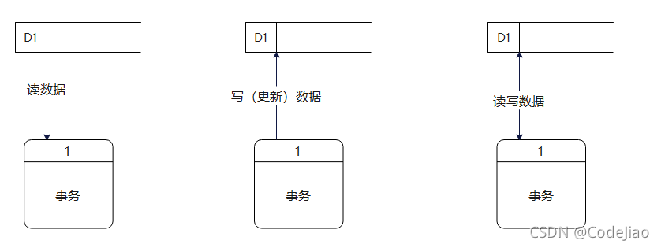

___

## 2\. 示例：工厂订单报表

假设一家工厂的采购部每天需要一张订货报表，报表按零件编号排序，表中列出所有需要再次订货的零件。对于每个需要再次订货的零件应该列出下述数据:零件编号，零件名称，订货数量，目前价格，主要供应者，次要供应者。零件入库或出库称为事务，通过放在仓库中的CRT终端把事务报告给订货系统。当某种零件的库存数量少于库存量临界值时就应该再次订货。

___

### 2.1 数据流图有4种成分分析

**数据流图有4种成分：源点和终点、处理、数据存储和数据流。画出上述定货系统的数据流图可采用以下步骤。**

1.  **首先考虑数据的源点和终点**，从上面对系统的描述可以知道“采购部每天需要一张订货报表”，“通过放在仓库中的终端把事务报告给订货系统”，所以**采购员是数据终点，而仓库管理员是数据源点**。
2.  **接下来考虑处理**。再一次阅读问题描述，“采购部需要报表”，显然他们还没有这种报表，因此必须有一个用于**产生报表的处理**。事务的后果是改变零件库存量，而任何改变数据的操作都是处理，因此，**对事务进行的加工是另一个处理**。注意，在问题描述中并没有明显地提到需要对事务进行处理，但是通过分析可以看出这种需要。
3.  **最后考虑数据流和数据存储**。系统把订货报表送给采购部，因此订货报表是一个数据流；事务需要从仓库送到系统中，显然事务是另一个数据流。产生报表和处理事务这两个处理在时间上明显不匹配：每当有一个事务发生时立即处理它，然而每天只产生一次订货报表，因此，用来产生订货报表的数据必须存放一段时间，也就是应该有一个数据存储（存储着订货报表的数据，每当订货报表的数据有更新时，可以立即获取最新的订货报表的数据，这样就可以实现每当有一个事务发生时立即处理它）。

**注意，并不是所有数据存储和数据流都能直接从问题描述中提取出来。例如，“当某种零件的库存数量少于库存量临界值时就应该再次订货”，这个事实意味着必须在某个地方有零件库存量和库存量临界值这样的数据。因为这些数据元素的存在时间看来应该比单个事务的存在时间长，所以认为有一个数据存储保存库存清单数据是合理的。**

下表列出了上面分析的结果，其中加星号标记的是在问题描述中隐含的成分。

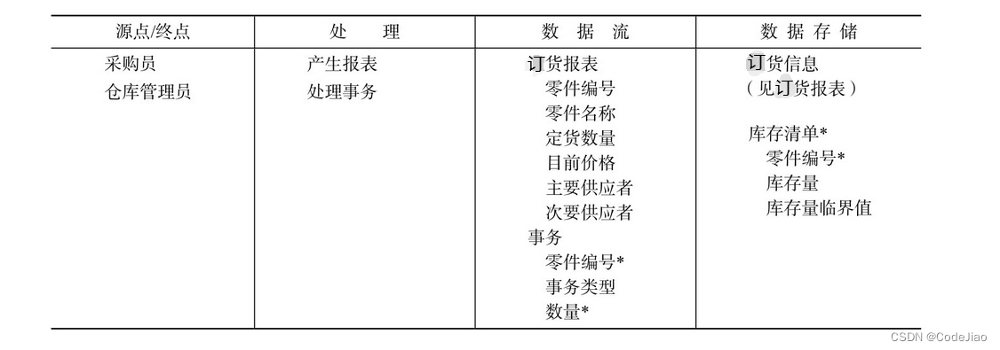

___

### 2.2 开始画数据流图

一旦把数据流图的4种成分分离出来后，就可以着手画数据流图了。但是要注意，数据流图是系统的逻辑模型，而任何计算机系统实质上都是信息处理系统，也就是说计算机系统本质上都是把输入数据变换成输出数据。因此，任何系统的基本模型都由若干个数据源点/终点以及一个处理组成，这个处理就代表了系统对数据加工变换的基本功能。

___

#### 2.2.1 顶层数据流图

对于上述的定货系统可以画出下图所示的顶层数据流图（**突出表明了数据的源点和终点**）。  
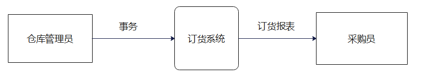  
从**顶层数据流图**这样非常高的抽象层次开始画数据流图是一个好办法。在这个高层次的数据流图上是否列出了所有给定的数据源点 / 终点是一目了然的，因此它是很有价值的沟通工具。

___

#### 2.2.2 第0层数据流图

**顶层数据流图**太抽象了，从这张图上所能了解到的信息非常有限。**下一步应该把基本系统模型细化，描绘系统的主要功能。**

由于 “产生报表” 和 “处理事务” 是该系统必须完成的两个主要功能，它们将代替图顶层数据流图中的“订货系统”。此外，细化后的数据流图中还增加了两个数据存储：处理事务需要“库存清单”数据；产生报表和处理事务在不同时间，因此需要存储“定货信息”。除了2.1节（2.1 数据流图有4种成分分析）的表中列出的两个数据流之外还有另外两个数据流，它们与数据存储相同。这是因为从一个数据存储中取出来的或放进去的数据通常和原来存储的数据相同，也就是说，数据存储和数据流只不过是同样数据的两种不同形式（事务 <–> 库存清单，订货信息 <–> 订货报表）。

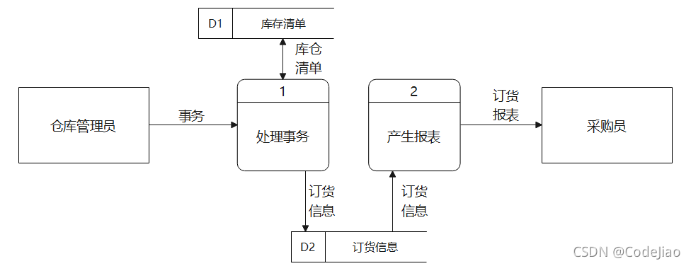

给处理和数据存储都加了编号，这样做的目的是便于引用和追踪。

___

#### 2.2.3 第1层数据流图

接下来应该对功能级数据流图中描绘的系统主要功能进一步细化。考虑通过系统的逻辑数据流，当发生一个事务时必须首先接收它；随后按照事务的内容修改库存清单；最后如果更新后的库存量少于库存量临界值时，则应该再次定货，也就是需要处理定货信息。因此，把“处理事务”这个功能分解为下述3个步骤：“接收事务”、“更新库存清单”和“处理订货”，这在逻辑上是合理的。

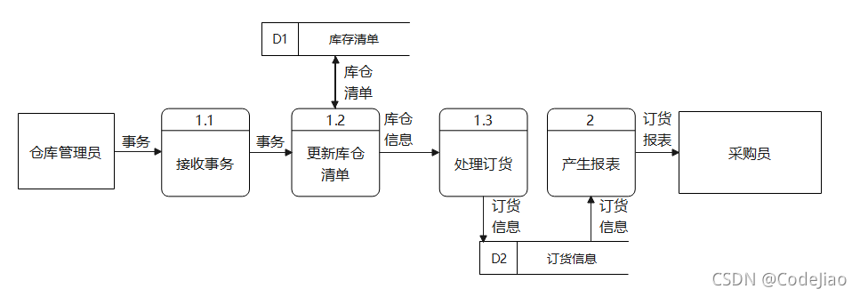

我们为什么不进一步分解“产生报表”这个功能呢？因为订货报表中需要的数据在存储的订货信息中全都有，产生报表只不过是按一定顺序排列这些信息，再按一定格式打印出来。然而这些考虑纯属具体实现的细节，不应该在数据流图中表现。同样道理，对“接收事务”或“更新库存清单”等功能也没有必要进一步细化。**总之，当进一步分解将涉及如何具体地实现一个功能时，就不应该再分解了。**

在对数据流图分层细化时必须保持信息连续性，即当把一个处理分解为一系列处理时，分解前和分解后的输入/输出数据流必须相同。

还应该注意在数据流图中对处理进行编号的方法。处理1.1，1.2和1.3是更高层次的数据流图中处理1的组成元素。如果处理2被进一步分解，它的组成元素的编号将是2.1， 2.2……如果把处理1.1进一步分解，则将得到编号为1.1.1，1.1.2……的处理，以此类推。

___

### 2.3 补充: 数据流图命名规范

数据流图中每个成分的命名是否恰当，直接影响数据流图的可理解性。  
因此，给这些成分起名字时应该仔细推敲。

数据源点/终点并不需要在开发目标系统的过程中设计和实现，它并不属于数据流图的核心内容，只不过是目标系统的外围环境部分（可能是人员、计算机外部设备或传感器装置）。通常，为数据源点 / 终点命名时采用它们在问题域中习惯使用的名字（如“采购员”、“仓库管理员”等）。

> 数据流（或数据存储）命名：

-   名字应代表整个数据流（或数据存储）的内容，而不是仅仅反映它的某些成分。
-   不要使用空洞的、缺乏具体含义的名字（如“数据”、“信息”、“输入”之类）。
-   如果在为某个数据流（或数据存储）起名字时遇到了困难，则很可能是因为对数据流图分解不恰当造成的，应该试试重新分解，看是否能克服这个困难。

> 处理命名：

-   通常先为数据流命名，然后再为与之相关联的处理命名。这样命名比较容易，而且体现了人类习惯的“由表及里”的思考过程。
-   名字应该反映整个处理的功能，而不是它的一部分功能。
-   名字最好由一个具体的及物动词加上一个具体的宾语组成。应该尽量避免使用“加工”、“处理”等空洞笼统的动词作为名字。
-   通常名字中仅包括一个动词。如果必须用两个动词才能描述整个处理的功能，则把这个处理再分解成两个处理可能更恰当些。
-   如果在为某个处理命名时遇到困难，则很可能是发现了分解不当的迹象，应考虑重新分解。

___

## 3\. 练习

___

### 3.1 教务管理子系统

教务管理是一项需求周密计划、严谨安排的工作，要依据教师、学生信息进行合理安排。

> 教务管理子系统的需求描述：

-   开学阶段，需要教师提交开课申请进行开课，学生根据老师的开课信息，选择课程，教务处生成学生课表、教师课表。
-   期末阶段，需要根据开课情况对学生进行考试安排，对教师进行监考安排，以及学生考试成绩管理。
-   学期结束，需要对学生成绩进行统计，计算绩点，排名，评定奖学金。

___

#### 3.1.1 顶层数据流图

___

#### 3.1.2 第0层数据流图

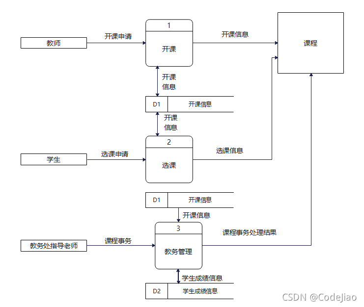

___

#### 3.1.3 第1层数据流图

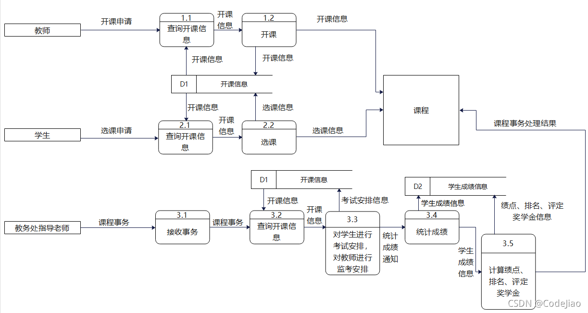

___

### 3.2 图书馆管理子系统

> 图书馆管理子系统的需求描述：

-   借书过程，学生到图书馆查询图书信息，出示借书证，办理借书。
-   还书过程，判断是否超期、图书是否破损，办理还书。

___

#### 3.2.1 顶层数据流图

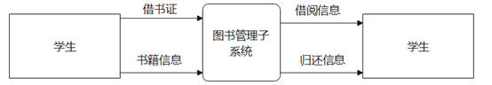

___

#### 3.2.2 第0层数据流图

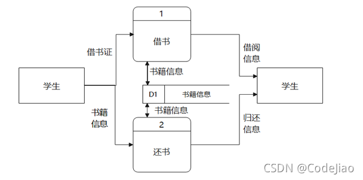

___

#### 3.2.3 第1层数据流图

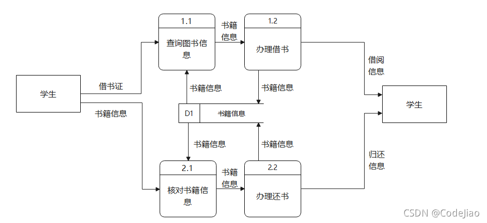

___

## 4\. 补充：数据流图的附加符号

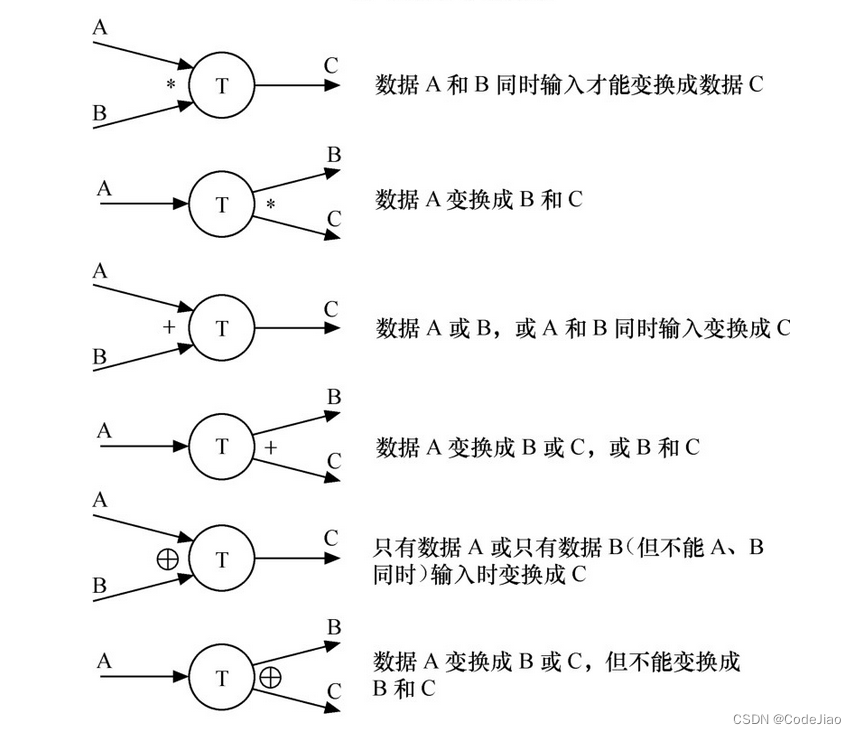

-   `*` 表示数据流之间是“**与**”关系（同时存在）
-   `+` 表示“**或**”关系
-   ⊕ 号表示只能从中选一个（互斥的关系）

注意：这里的圆形可以被圆角矩形框替换，都表示变换数据的处理。  

___

## 5\. 说明：顶层数据流图和0层的关系

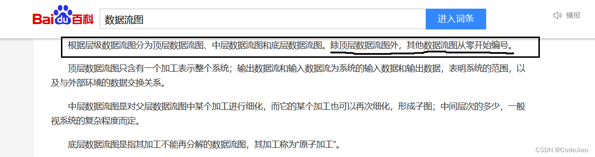

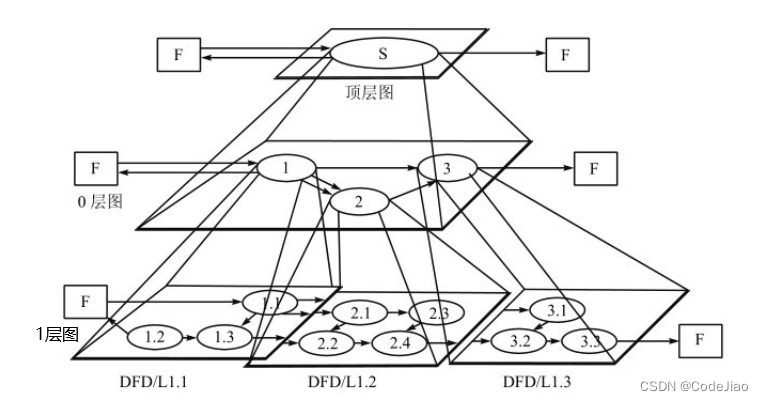

-   **顶层数据流图只含一个加工表示整个系统**
-   **0层数据流图是对父层数据流图中某个加工进行细化，它的某个加工也可以再次细化，形成子图，层次的多少，一般视系统的复杂程度而定。**

___

___