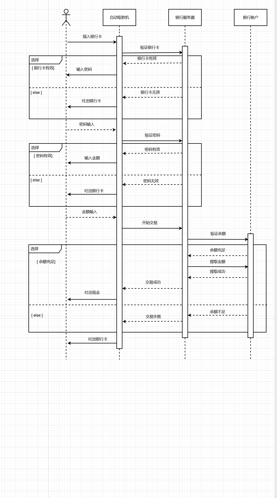
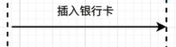
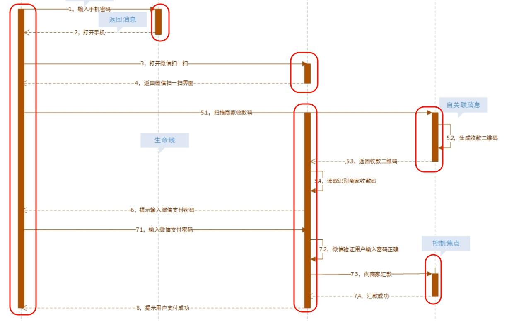
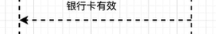
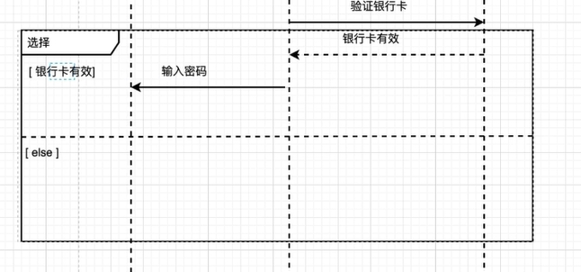
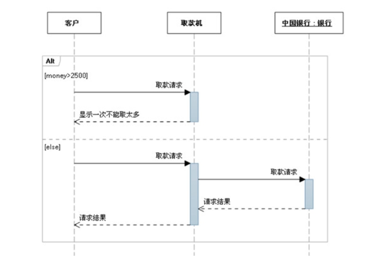
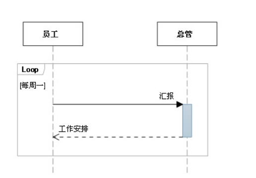
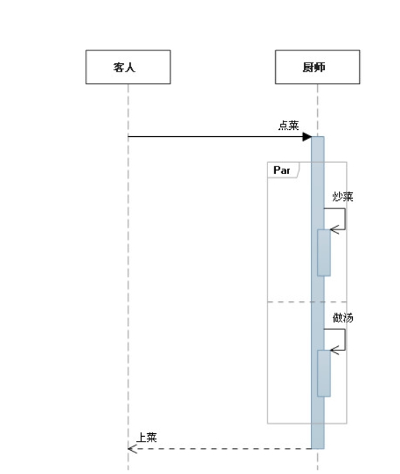

# 时序图

## 时序图结构

## 时序图的基本概念

### **时序图的主要元素**

#### **1. 对象（Object）**
- **描述**：表示参与交互的对象或类实例。
- **表示**：用一个矩形框表示，框内标注对象名称和类名，格式为 `对象名: 类名`。
- 

#### **2. 生命线（Lifeline）**
- **描述**：表示对象在交互过程中的生命周期，用一条垂直虚线表示。
- **表示**：从对象矩形框底部延伸出一条虚线。

#### **3. 消息（Message）**
- **描述**：表示对象之间的通信，可以是方法调用、信号发送等。

- **表示**：用一条带箭头的实线表示，箭头指向接收消息的对象。

    

#### **4. 激活条（Activation Bar）**
- **描述**：表示对象执行操作的时间段，用一条垂直矩形条表示。
- **表示**：在生命线上绘制一个矩形条，表示对象正在处理消息。
- 

#### **5. 返回消息（Return Message）**
- **描述**：表示消息的返回结果，用一条带箭头的虚线表示。

- **表示**：箭头指向发送消息的对象。

    

#### **6. 条件分支（Conditional Branch）**
- **描述**：表示根据条件执行不同的交互流程，用 `alt` 或 `opt` 组合片段表示。

- **表示**：用一个大矩形框表示，内部标注条件。

    

    

#### **7. 循环（Loop）**
- **描述**：表示重复执行的交互流程，用 `loop` 组合片段表示。

- **表示**：用一个大矩形框表示，内部标注循环条件。

- 

    

    #### 8. 并行

    - 

