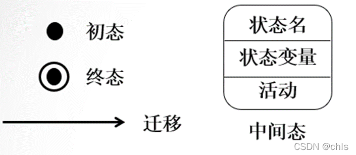
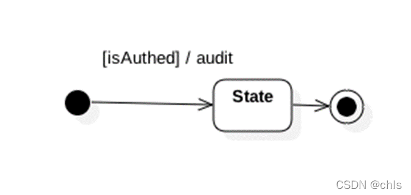
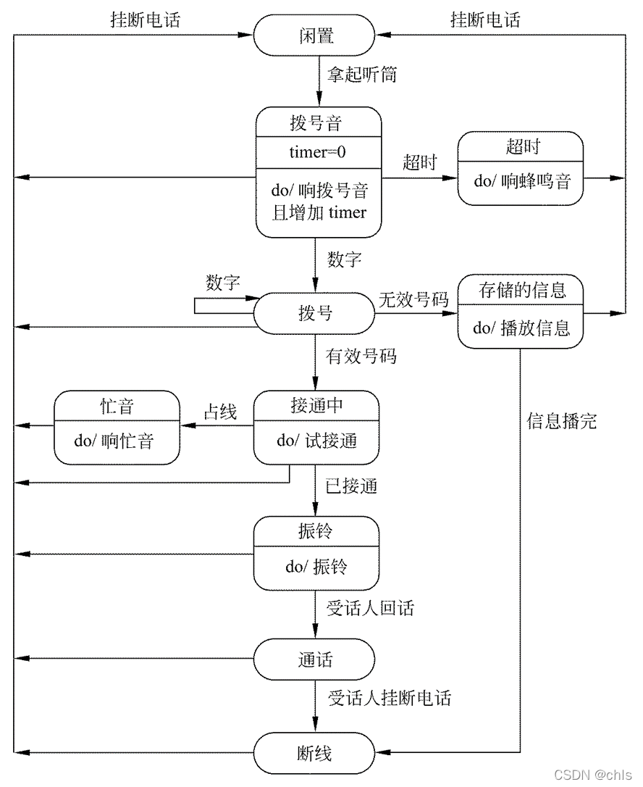
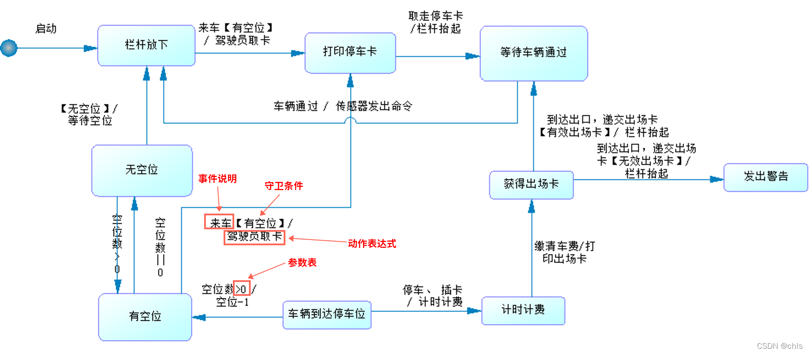
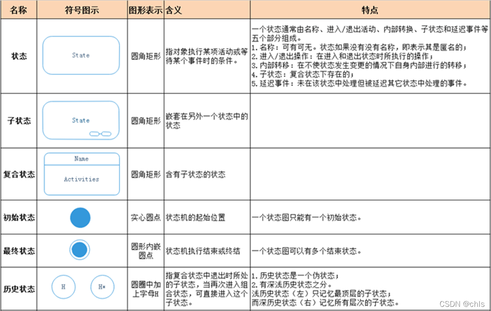
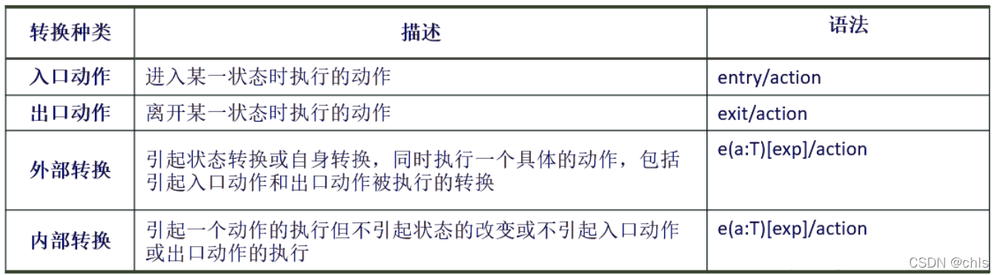
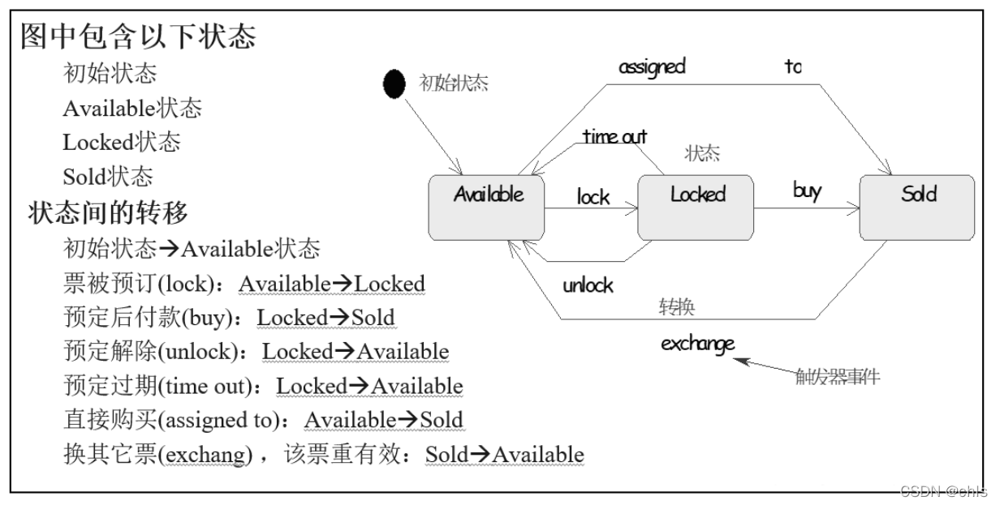
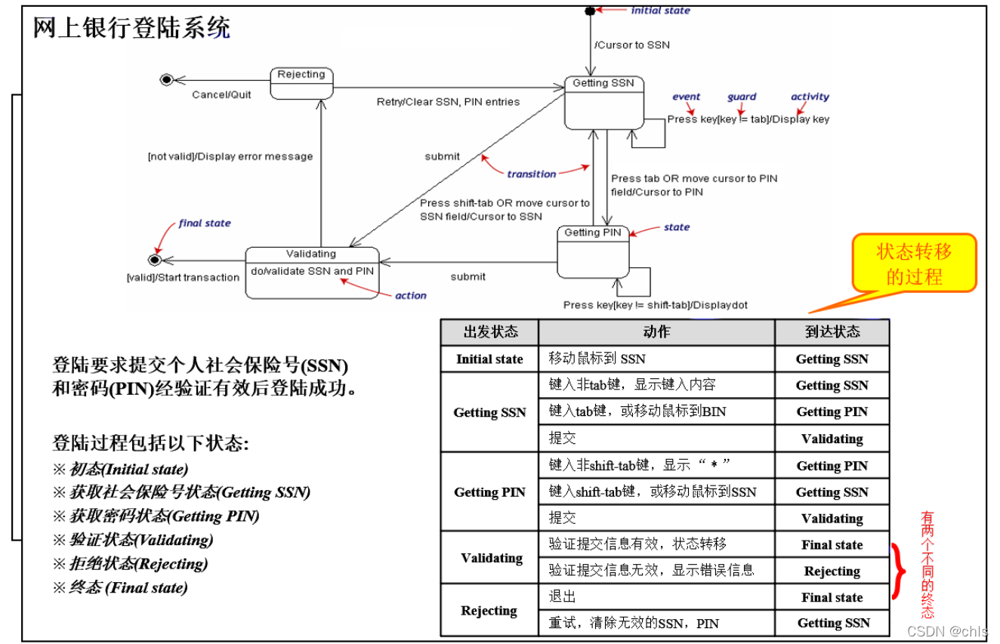

## UML之状态图

## 一、[状态图](https://so.csdn.net/so/search?q=%E7%8A%B6%E6%80%81%E5%9B%BE&spm=1001.2101.3001.7020)概要

        **状态图是一种行为图**。描述一个特定对象的所有可能的状态以及引起状态转换的事件。

>         在面向对象的软件系统中，一个对象无论多么简单或者多么复杂，都必然会经历一个从开始创建到最终消亡的完整过程，这个过程通常被称为对象的生命周期。一般来说，对象在其生命周期内是不可能完全孤立的，它必然会接受消息来改变自身，或者发送消息来影响其他对象。而[状态机](https://so.csdn.net/so/search?q=%E7%8A%B6%E6%80%81%E6%9C%BA&spm=1001.2101.3001.7020)就是用于说明对象在其生命周期中响应时间所经历的状态序列以及其对这些事件的响应。在状态机的语境中，一个事件就是一次激发的产生，每个激发都可以触发一个状态转换。
>
>         **状态机由状态、转移、事件、活动和动作五部分组成。**

## 二、状态图的组成

<table><tbody><tr><td><strong>状态机</strong></td><td><strong>注释</strong></td></tr><tr><td>状态</td><td>状态指的是对象在其生命周期中的一种状况，处于某个特定状态中的对象必然会满足某些条件、执行某些动作或者是等待某些事件。一个状态的生命周期是一个有限的时间阶段。</td></tr><tr><td>转移</td><td>转移指的是两个不同状态之间的一种关系，表明对象在第一个状态中执行一定的动作，并且在满足某个特定条件下由某个事件触发进入第二个状态。</td></tr><tr><td>事件</td><td>事件指的是发生在时间和空间上的对状态机来讲有意义的那些事情。事件通常会引起状态的变迁，促使状态机从一种状态切换到另一种状态，如信号、对象额度创建和销毁等。</td></tr><tr><td>活动</td><td>
活动指的是状态机中进行的非<a href="https://so.csdn.net/so/search?q=%E5%8E%9F%E5%AD%90%E6%93%8D%E4%BD%9C&amp;spm=1001.2101.3001.7020" target="_blank" data-report-view="{&quot;spm&quot;:&quot;1001.2101.3001.7020&quot;,&quot;dest&quot;:&quot;https://so.csdn.net/so/search?q=%E5%8E%9F%E5%AD%90%E6%93%8D%E4%BD%9C&amp;spm=1001.2101.3001.7020&quot;,&quot;extra&quot;:&quot;{\&quot;searchword\&quot;:\&quot;原子操作\&quot;}&quot;}" data-report-click="{&quot;spm&quot;:&quot;1001.2101.3001.7020&quot;,&quot;dest&quot;:&quot;https://so.csdn.net/so/search?q=%E5%8E%9F%E5%AD%90%E6%93%8D%E4%BD%9C&amp;spm=1001.2101.3001.7020&quot;,&quot;extra&quot;:&quot;{\&quot;searchword\&quot;:\&quot;原子操作\&quot;}&quot;}" data-tit="原子操作" data-pretit="原子操作">原子操作</a>。
</td></tr><tr><td>动作</td><td>动作指的是状态机中可以执行的哪些原子操作。所谓原子操作，指的是他们在运行的过程中不能被其他消息中断，必须一直执行下去，以至最终导致状态的变更或者返回一个值。</td></tr></tbody></table>

## 三、状态图中的事物及解释

### 1、状态和转移：

> **起始状态：**黑色实心  
> **终止状态：**用一对同心圆(内圆为实心圆)表示  
> **行为转移：**两个状态之**间带箭头的连线**，**箭头指明了转换方向**。  
> **中间状态：**用圆角矩形表示，可以用两条水平横线把它分成上、中、下3个部分。（上面部分为状态的名称，这部分是必须有的；中间部分为状态变量的名字和值，这部分是可选的；下面部分是活动表，这部分也是可选的）
>
> 

### **2、事件说明**

> 事件名(参数表)\[守卫条件\]/动作表达式^发送子句  
> 其中isAuthed为一个guard说明满足该条件才会进行状态转移，然后执行函数auidt。
>
> 

### **3、活动**

> **活动表的语法格式：事件名(参数表)/动作表达式  
> 事件名：任何事件的名称。  
> 在活动表中经常使用下述3种标准事件：entry, exit和do。**
>
> -   **entry**：事件指定进入该状态的动作，
> -   **exit** ： 事件指定退出该状态的动作，
> -   **do** : 事件指定在该状态下的动作。
>
> 需要时可以为事件指定参数表。活动表中的动作表达式描述应做的具体动作。  
>
>
> 

### 4、事件表达式

>         状态变迁通常是由事件触发的，在这种情况下应在表示状态转换的箭头线上标出触发转换的事件表达式；如果在箭头线上未标明事件，则表示在源状态的内部活动执行完之后自动触发转换。
>
>         **语法如下：**  
>         事件说明［守卫条件］/ 动作表达式  
>         其中，事件说明的语法为：事件名(参数表)。
>
>         

### **5、完整符号信息：**

## 四、状态的可选活动表

## 五、状态图例子

### 1、对象的状态图

### 2、网上银行登录系统

