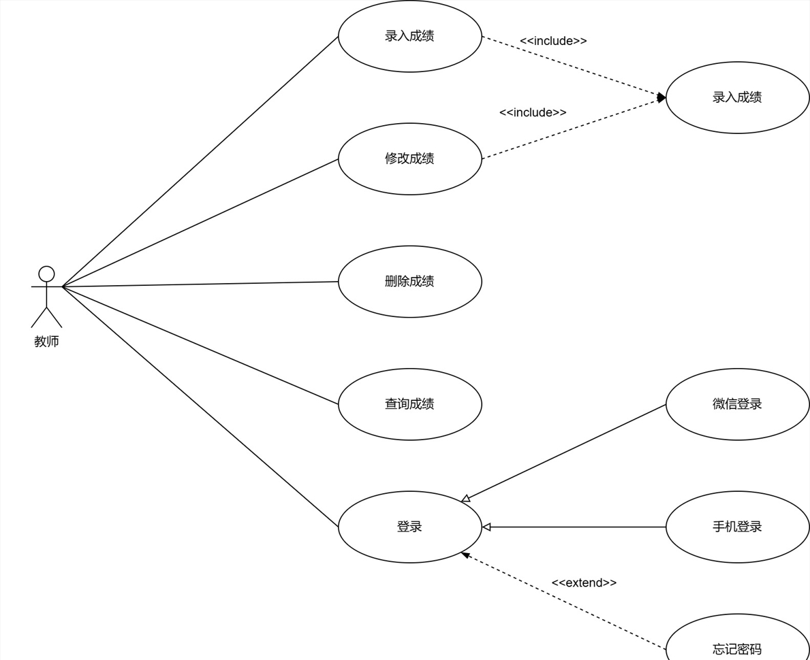

# 用例图

## 用例图的结构

## 用例图的基本元素

>
>
>系统：
>
>1. 使用一个大矩阵表示
>
>参与者：
>
>1. 使用小人表示
>2. 参与者有两种
>    1. 主要参与者
>    2. 次要参与者
>    3. 只有 主要参与者 作出动作之后，次要参与者才会响应
>    4. 主要参与者 应该在 矩阵 的左边  次要参与者应该 要在 矩阵 的  右边
>
>用例：
>
>1. 就是功能函数 
>2. 每一个用例 都是 动词
>
>关系：
>
>1. 关联
>2. 泛化
>3. 包含
>4. 扩展
>
>

## 用例图存在的关系

 	